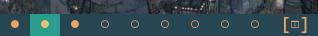

# dwm 

### Dual patch only 

This patch allows for easy switching between original tag names and custom active/empty tag names. `tags` array is used to determine how many window tags to draw. To reduce the amount of windows, simply remove some entries from there. To have windows in use, but not draw them if they are empty, use [hide vacant tags](https://dwm.suckless.org/patches/hide_vacant_tags/) patch.

Entries can be anything, but this patches uses [Nerd font](https://www.nerdfonts.com/#home) icons.

dwm - dynamic window manager
============================
dwm is an extremely fast, small, and dynamic window manager for X.

Requirements
------------
In order to build dwm you need the Xlib header files.

Installation
------------
Edit config.mk to match your local setup (dwm is installed into
the /usr/local namespace by default).

Afterwards enter the following command to build and install dwm (if
necessary as root):

    make clean install

Running dwm
-----------
Add the following line to your .xinitrc to start dwm using startx:

    exec dwm

In order to connect dwm to a specific display, make sure that
the DISPLAY environment variable is set correctly, e.g.:

    DISPLAY=foo.bar:1 exec dwm

(This will start dwm on display :1 of the host foo.bar.)

In order to display status info in the bar, you can do something
like this in your .xinitrc:

    while xsetroot -name "`date` `uptime | sed 's/.*,//'`"
    do
    	sleep 1
    done &
    exec dwm

Configuration
-------------
The configuration of dwm is done by creating a custom config.h
and (re)compiling the source code.
